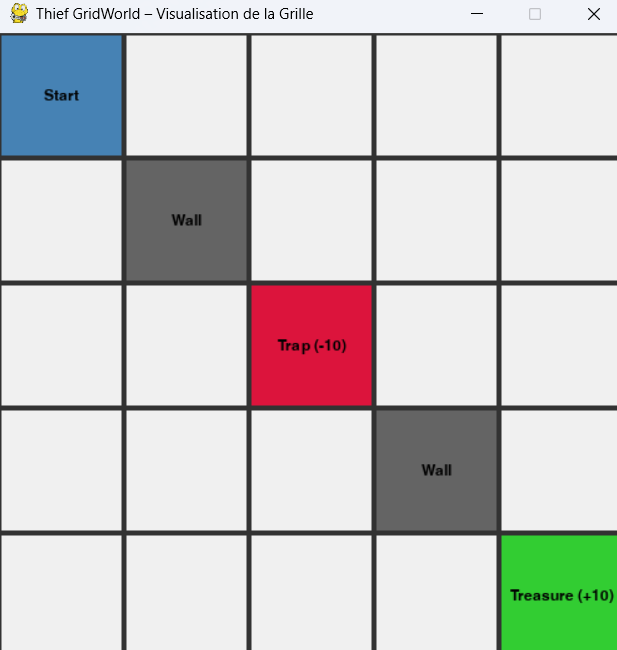

# Projet RL – Thief GridWorld  
**Apprentissage par Renforcement – Implémentation de 6 algorithmes classiques**

Ce projet implémente un environnement personnalisé en **PyGame** (similaire à GridWorld) et compare **6 algorithmes d’apprentissage par renforcement** vus en cours :
- Programmation Dynamique (DP)
- Monte Carlo (MC)
- Différence Temporelle (TD(0))
- SARSA
- Q-learning
- Double Q-learning

---

## 🎮 Environnement personnalisé : *Thief GridWorld*

- Grille **5×5**
- **Départ** : (0, 0)
- **Trésor** 🟢 : (4, 4) → récompense **+10**
- **Piège** 🔴 : (2, 2) → récompense **-10**
- **Murs** ⬛ : (1,1) et (3,3) → cases inaccessibles
- **Dynamique stochastique** : 80 % de chance de réussir l’action, 20 % d’action aléatoire
- Tâche **épisodique** (max 100 pas)

 

---

## 🧠 Algorithmes implémentés

| Algorithme           | Type         | On/Off-policy | Utilisé pour le contrôle ? |
|----------------------|--------------|---------------|----------------------------|
| DP (Policy Iteration)| Basé sur modèle | -            | ✅ Oui                     |
| Monte Carlo          | Sans modèle  | On-policy     | ✅ Oui                     |
| TD(0)                | Sans modèle  | On-policy     | ❌ (évaluation seulement) |
| SARSA                | Sans modèle  | On-policy     | ✅ Oui                     |
| Q-learning           | Sans modèle  | **Off-policy**| ✅ Oui                     |
| Double Q-learning    | Sans modèle  | Off-policy    | ✅ Oui                     |

---

## ▶️ Comment exécuter le projet

### 1. Cloner le dépôt
```bash
git clone https://github.com/votre-pseudo/rl-gridworld-project.git
cd rl-gridworld-project
